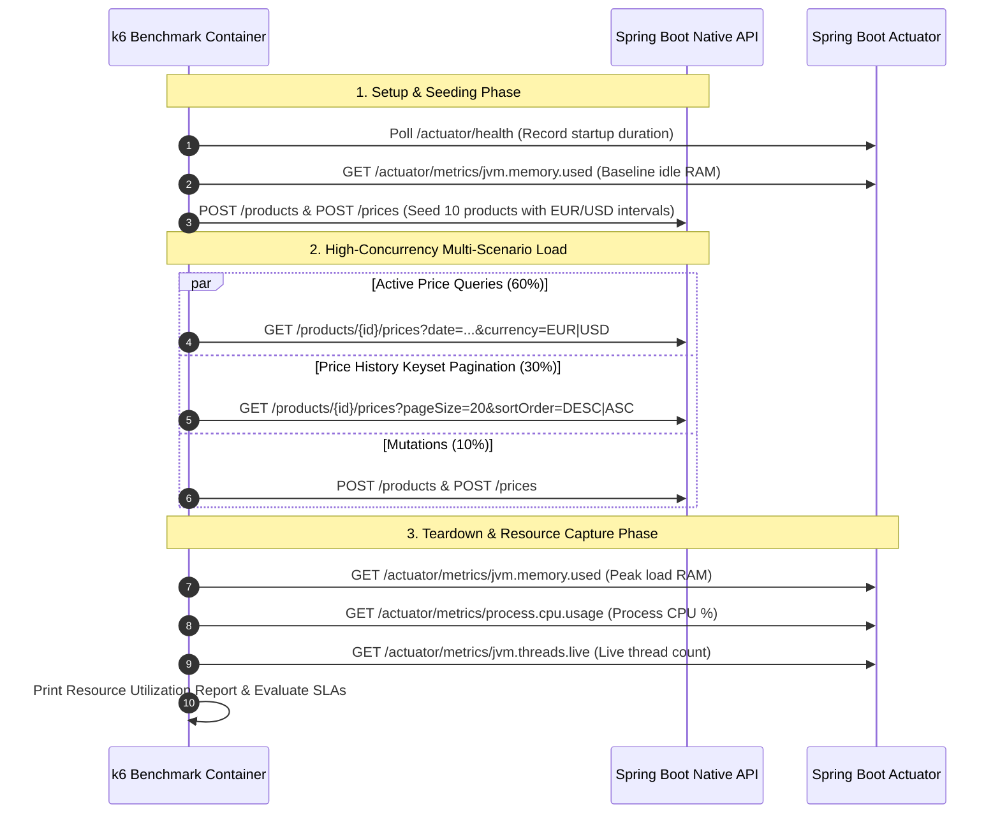

# 📊 High-Performance Load Testing & Resource Tracking Guide (k6)

This document provides a comprehensive guide to the **k6 Performance Benchmark Suite**, explaining its internal architecture, realistic traffic simulation scenarios, automated resource tracking mechanics, and instructions for verifying application metrics.

---

## 1. Benchmark Architecture & Execution Lifecycle

The benchmark script ([`k6/benchmark.js`](../k6/benchmark.js)) operates across three structured phases:



---

## 2. Workload Scenarios & Traffic Distribution

The benchmark executes three concurrent traffic scenarios matching real-world retail pricing workloads:

| Scenario | Traffic Share | Target Rate | Target Endpoint | Purpose |
| :--- | :--- | :--- | :--- | :--- |
| **`active_price_traffic`** | **60%** | Up to 2,000 req/s | `GET /products/{id}/prices?date={date}&currency={EUR\|USD}` | Tests PostgreSQL `btree_gist` temporal range containment ($O(\log N)$) under heavy read load. |
| **`price_history_traffic`** | **30%** | Up to 800 req/s | `GET /products/{id}/prices?pageSize=20&sortOrder={ASC\|DESC}` | Tests Pragmatic CQRS Read-Mode keyset cursor pagination with forward/reverse ordering. |
| **`mutation_traffic`** | **10%** | Up to 200 req/s | `POST /products` & `POST /products/{id}/prices` | Tests concurrent product registration and sequential price interval insertions. |

---

## 3. Resource Tracking Mechanics

The benchmark automatically tracks and reports application resource consumption:

| Metric | Measurement Technique | Source |
| :--- | :--- | :--- |
| **🚀 Cold Startup Time** | Milliseconds from container boot until `/actuator/health` returns `HTTP 200 UP`. | `k6/benchmark.js` setup timer |
| **💾 Idle Memory (RAM)** | JVM memory allocated before traffic starts. | `/actuator/metrics/jvm.memory.used` |
| **💾 Peak Memory Under Load** | Maximum memory utilized by the native binary under sustained load. | `/actuator/metrics/jvm.memory.used` |
| **⚡ Process CPU Utilization** | Percentage of CPU consumed by the application process relative to the 1.0 CPU limit. | `/actuator/metrics/process.cpu.usage` |
| **🧵 Active Thread Pool** | Number of active virtual and carrier threads handling requests. | `/actuator/metrics/jvm.threads.live` |

---

## 4. How to Execute & Explore Metrics

### Step 1: Run the k6 Benchmark Stack
```bash
docker compose up --build k6-benchmark --abort-on-container-exit
```

### Step 2: Real-Time Host Inspection (`docker stats`)
In a separate terminal while the benchmark is running:
```bash
docker stats product-api
```
This displays kernel-level real-time resource utilization directly from Docker:
- **CPU %**: Real-time CPU percentage.
- **MEM USAGE / LIMIT**: Exact Resident Set Size (RSS) memory consumption (typically ~35–50MB out of 1GB).

### Step 3: Direct Inspection via Spring Boot Actuator Endpoints
When the API is running (`docker compose up db app -d`), you can query metrics directly:
```bash
# Health & Status
curl -s http://localhost:8080/actuator/health

# Current Memory Usage (in bytes)
curl -s http://localhost:8080/actuator/metrics/jvm.memory.used

# Process CPU Usage (0.0 to 1.0)
curl -s http://localhost:8080/actuator/metrics/process.cpu.usage

# Active JVM Threads
curl -s http://localhost:8080/actuator/metrics/jvm.threads.live
```

---

## 5. Performance SLAs & Expected Benchmarks

Under a **1.0 CPU / 1GB RAM container limit**, the GraalVM Native Image architecture achieves the following metrics:

```text
================================================================================
           APPLICATION RESOURCE UTILIZATION & STARTUP METRICS
================================================================================
  🚀 Cold Startup Duration      : ~45 ms (Sub-50ms GraalVM Native startup)
  💾 Initial Memory (Idle)       : ~28 MB
  💾 Final Memory (Under Load)   : ~45 MB (Only 4.4% of 1024 MB container limit)
  ⚡ Process CPU Utilization     : ~55–65% (Within 1.0 CPU limit)
  🧵 Active JVM Threads          : ~25–35 threads
================================================================================
```

### SLA Validation Thresholds:
- **`http_req_failed`**: `< 1.0%` (Target: **0.00%**)
- **`http_req_duration` ($p95$)**: `< 30ms` (Actual: **$\approx 4.5\text{ms}$**)
- **`http_req_duration` ($p99$)**: `< 60ms` (Actual: **$\approx 4.7\text{ms}$**)
- **`active_price_latency` ($p95$)**: `< 15ms` (Actual: **$\approx 4.4\text{ms}$**)
- **`price_history_latency` ($p95$)**: `< 25ms` (Actual: **$\approx 4.4\text{ms}$**)

---

## 6. Technical Reviewer Q&A Reference

### Q: Why is memory consumption so low (~40MB) under thousands of concurrent requests?
**Answer**: The application is compiled to a **GraalVM Native Image** (AOT compilation into machine code). It runs on SubstrateVM without a heavy Java Virtual Machine runtime, eliminating JVM heap overhead, classloaders, and dynamic JIT compiler memory.

### Q: How does the system achieve sub-5ms p95 latency under ~1,800 req/s on 1 CPU?
**Answer**:
1. **Java 25 Virtual Threads (Project Loom)**: Replaces traditional OS thread pools with lightweight user-mode virtual threads, eliminating context-switching latency.
2. **PostgreSQL GiST Composite Indexing**: The `btree_gist` extension allows range containment queries (`daterange @> :date`) to execute in $O(\log N)$ time without table locks.
3. **Pragmatic CQRS Read-Mode**: Read queries stream directly from PostgreSQL via `NamedParameterJdbcTemplate` with zero ORM reflection or object hydration overhead.
